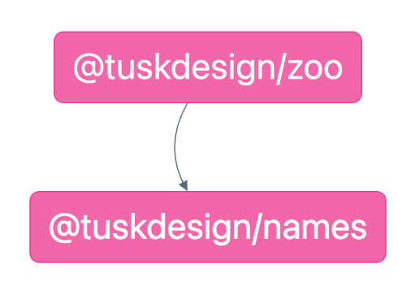

---

**[← Previous: Run Tasks and Task Pipelines](./02-task-pipelines.md) | [Next: Project Setup →](./04-project-setup.md)**

---

✋ Raise your hand to show you've started the exercise. ✋
---

# 📖 Exercise: Affected & Caching

In this exercise we'll learn how Nx improves the performance of your tasks with caching and the affected command.

## 0. Git commit
In order to have a clean state, we will need to commit our changes. 

<details>
  <summary>Commit changes</summary>

```bash
git commit -a -m "initial setup"
```

or just use the IDE to commit the changes.

</details>  

## 1. Make changes
In this part we will make some changes to the code base. And see how the `affected` command works based on where the changes are being made.

### 1.1 Make change in app
First, we will make a change in the `names` project. Go to the `packages/names/names.ts` file and change the first name in the `NAMES` list from `Brie` to `Inigo` (or whatever name you want).

<details>
  <summary>Change a name in `packages/names/names.ts`</summary>

```diff
- "Brie",
+ "Inigo",
```

</details>

### 1.2 Affected
In this part we will see how the `affected` command works. Nx's `affected` command saves you from running tasks that are guaranteed to not have their outputs altered by your code changes.  In this case, changes to the `names` project will force you to run tasks for `names` and `zoo`, but the tasks for `animals` don't need to be run.

#### 1.2.1 Affected Project Graph for `build` target
To see the projects that are affected by the change, run the `affected` command with the `--graph` flag.

<details>
  <summary>Run `affected` command</summary>

```bash
nx graph --affected
```

The output should look like this:




</details>

#### 1.2.2 Run `build` for affected projects
Now lets run the `build` target for the affected projects.

<details>
  <summary>Run `build` for affected projects</summary>

```bash
nx affected --target build
```

The output should look like this:

```
❯ nx affected --target build

 NX   Affected criteria defaulted to --base=main --head=HEAD


   ✔  nx run @tuskdesign/animals:build
   ✔  nx run @tuskdesign/names:build
   ✔  nx run @tuskdesign/zoo:build

————————————————————————————————————————————————————————————————————————————————————————————————————————————————————————————————————————————

 NX   Successfully ran target build for 2 projects and 1 task they depend on (1s)

Nx read the output from the cache instead of running the command for 1 out of 3 tasks.
```

The affected logic goes through these steps:

1. Nx uses a git diff to identify the `packages/names/names.ts` file as the only changed file.
2. Nx identifies the file is in the `names` project.
3. Nx uses the project graph to list all the projects that have the `names` project as a direct or transitive dependency. e.g. `zoo`
4. Nx runs the `build` task for `zoo` and `names`
5. Since the `build` task for `zoo` depends on `animals` as well, that task is also run - and replayed from the cache.

</details>

#### 1.2.3 Affected Command (nx affected typecheck)
Just like the `build` target, we can skip running the `typecheck` for the `animals` library by using the `affected` command.

<details>
  <summary>Run `affected` for `typecheck` target</summary>

```bash
nx affected --target typecheck
```

The results are:

```
❯ nx affected --target typecheck

 NX   Affected criteria defaulted to --base=main --head=HEAD


   ✔  nx run @tuskdesign/names:typecheck
   ✔  nx run @tuskdesign/zoo:typecheck

————————————————————————————————————————————————————————————————————————————————————————————————————————————————————————————————————————————

 NX   Successfully ran target typecheck for 2 projects (593ms)
```
</details>

We can see that only the `zoo` and `names` projects have `typecheck` run.

</details>

## 2. Local Cache in Action
In this part we will see how the local cache works and how it affects/optimizes the build process.

To prepare for this section, clear you local cache with the `nx reset` command:

```
nx reset
```

You can also skip the cache for a single command using the `--skip-nx-cache` flag.

### 2.1 Build once
In this part we will build the `zoo` project once.

<details>
  <summary>Build `zoo` project once</summary>

```bash
nx build zoo
```

The output should look like this:

```
❯ nx build zoo

> nx run @tuskdesign/names:build


> @tuskdesign/names@1.2.0 build
> tsc --build tsconfig.lib.json


> nx run @tuskdesign/animals:build


> @tuskdesign/animals@1.2.0 build
> tsc --build tsconfig.lib.json


> nx run @tuskdesign/zoo:build


> @tuskdesign/zoo@1.2.0 build
> tsc --build tsconfig.lib.json


————————————————————————————————————————————————————————————————————————————————————————————————————————————————————————————————————————————

 NX   Successfully ran target build for project @tuskdesign/zoo and 2 tasks it depends on (1s)
```

</details>

### 2.2 Build again
Now that we already built the `zoo` project once, let's see how the build process works when we run the `build` target again.

<details>
  <summary>Build the `zoo` project again</summary>

```bash
nx build zoo
```

The output should look like this:

```
❯ nx build zoo

> nx run @tuskdesign/names:build  [existing outputs match the cache, left as is]


> nx run @tuskdesign/animals:build  [existing outputs match the cache, left as is]


> nx run @tuskdesign/zoo:build  [existing outputs match the cache, left as is]


————————————————————————————————————————————————————————————————————————————————————————————————————————————————————————————————————————————

 NX   Successfully ran target build for project @tuskdesign/zoo and 2 tasks it depends on (162ms)

Nx read the output from the cache instead of running the command for 3 out of 3 tasks.
```

We will see that the build process is much faster, because the output of the build is read from the cache.

</details>

The second build, lint & test will be much faster, because the output of the target is read from the cache.

---
👏 Lower your hand to show you've finished the exercise. 👏
---

## 🏃‍♂️‍➡️ Action Steps

**👟 Next Step:**
- Identify tasks that should be cached

**🧠 Discussion Topics:**
- Do you have any custom tasks that should be cached? A cacheable task is any task that has deterministic outputs given the same inputs. Tasks like `build` and `test` are typically cacheable. Tasks like `serve` are typically not.
- What factors in your codebase would cause a task to not be cacheable? This includes things like:
  - Interactions with external APIs or databases
  - Continuous tasks (i.e. `serve` or `watch`)
  - Randomization
  - Missing or incorrect input configuration
- See: https://nx.dev/recipes/running-tasks/configure-inputs

---

**[← Previous: Run Tasks and Task Pipelines](./02-task-pipelines.md) | [Next: Project Setup →](./04-project-setup.md)**

---

