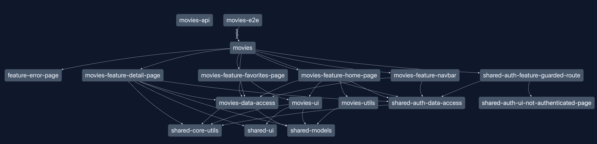

# 📖 Nx Scalable Architecture Design

---

**[← Previous: Project Setup](./04-project-setup.md) | [Next: Module Boundaries →](./06-enforce-module-boundaries.md)**

---

✋ Raise your hand to show you've started the exercise. ✋
---

In this exercise we will learn how to create scalable architecture design using Nx.
We will create multiple libraries of different types (feature, data-access, ui, util) and scopes (movies, shared).

# Goal

In the end our project graph should look like this:



## Migration Guideline

When refactoring a monolith to a scalable separated architecture, let's stick to the migration strategy discussed
before:

1. low hanging fruits 🍏: Code that doesn’t have any dependencies (mostly utils, models, types)
2. Move code that only depend on libraries (ui only, data-access)
3. Move features into feature libraries (pages, routing)


In our case, the architecture is mostly in place already. Only a couple of pieces are remaining to
be moved.

## 0. Project Setup

> [!NOTE]
> From here on, we are using the REAL project, not the one you have created in the exercises before
> Please make sure you have set it up properly, by following the instructions:
> 
> [PROJECT SETUP](./project-setup.md)

## 1. Current State

Run the project graph & inspect the current architecture.

```shell
npx nx graph
```

Also take a look at the current folder structure.
Especially watch out if the `apps/movies` project is actually empty - as desired.

We want to have the following folder structure in the end

```bash
apps/
    movies/
libs/
    movies/
        feature-navbar/
        feature-favorites-page/
        feature-home-page/ # <- missing
        feature-movie-detail/
        ui-movie-card/
        data-access/
        utils/ # <- missing
    shared/
        auth/
            data-access/
            feature-guarded-route/
            ui-not-authenticated-page/
        core-utils/
        ui/
        models/
        feature-error-page/
```

The goal should be to create the remaining libraries for the `feature-home-page` & the `movies-utils`.

## 2. Migrate utils first

As learned, we should move code that has no other dependencies to the app.
The homepage imports the utils, so we should start with utils first.

Tasks:  

* Create a new library called `movies-utils` in `libs/movies/utils`
* move code from `apps/movies/src/utils` to the new library
* adjust exports in `libs/movies/utils/index.ts` of
* adjust imports in `apps/movies/src/homepage`

<details>
  <summary>Library creation for movies-utils</summary>

```bash
npx nx generate @nx/react:library libs/movies/utils --name movies-utils
```

</details>


Now you should notice that you got a new folder in `libs/movies/utils`, containing a project.json and other
configuration files.

You also see the `tsconfig.base.json` being adjusted, it now contains a new path configuration for the new library: `@react-monorepo/movies-utils`.

<details>
  <summary>move code from `apps/movies/src/utils` to the new library </summary>

 ```shell
 /libs
    /movies
      /utils
        /src
          search-movies-by-title.util.ts # <- move file here

 ```

</details>

<details>
  <summary>adjust exports in `libs/movies/utils/src/index.ts` of </summary>

```ts
// libs/movies/utils/src/index.ts

export { searchMoviesByTitle } from './search-movies-by-title.util.ts';

```

</details>


<details>
  <summary>adjust imports in `apps/movies/src/homepage` </summary>

```ts
// apps/movies/src/homepage/homepage.tsx

import { searchMoviesByTitle } from '@react-monorepo/movies-utils';

```

</details>

Great!

Now inspect the nx graph again and spot if you can see your new library.

```shell
npx nx graph
```

## 3. Migrate home-page feature

The last remaining code to migrate into a library is the homepage feature.

Tasks:  

* Create a new library called `movie-feature-home-page` in `libs/movies/feature-home-page`
* move code from `apps/movies/src/app/homepage` to the new library
* adjust exports in `libs/movies/feature-home-page/src/index.ts`
* adjust imports in `apps/movies/src/app/routes/routes.tsx`

<details>
  <summary>Library creation for movie-feature-home-page</summary>

```bash
npx nx generate @nx/react:library libs/movies/feature-home-page --name movie-feature-home-page
```

</details>

Now you should notice that you got a new folder in `libs/movies/feature-home-page`, containing a project.json and other
configuration files.

You also see the `tsconfig.base.json` being adjusted, it now contains a new path configuration for the new library: `@react-monorepo/movie-feature-home-page`.

<details>
  <summary>move code from `apps/movies/src/app/homepage` to the new library </summary>

 ```shell
 /libs
    /movies
      /feature-home-page
        /src
          homepage.tsx # <- move file here

 ```

</details>

<details>
  <summary>adjust exports in `libs/movies/feature-home-page/src/index.ts` </summary>

```ts
// libs/movies/feature-home-page/src/index.ts

export { Homepage } from './homepage';

```

</details>

<details>
  <summary>adjust imports in `apps/movies/src/app/routes/routes.tsx` </summary>

```ts
// apps/movies/src/app/routes/routes.tsx

import { Homepage } from '@react-monorepo/movie-feature-home-page';

```

</details>

## 4. Inspect nx graph - validate the goal


Again show the nx graph and validate if the changes are correct and our final architecture resembles our goal from the beginning.


---
👏 Lower your hand to show you've finished the exercise. 👏
---

## 🏃‍♂️‍➡️ Action Steps

**👟 Next Step:**
- Identify projects in your repository that should be split into multiple projects

**🧠 Discussion Topics:**
- Projects with these characteristics might be good candidates to be split:
  - A project that is depended on by a lot of other projects
  - A project that is a collection of unrelated code
- See: https://nx.dev/concepts/decisions/project-size

---

**[← Previous: Project Setup](./04-project-setup.md) | [Next: Module Boundaries →](./06-enforce-module-boundaries.md)**

---
