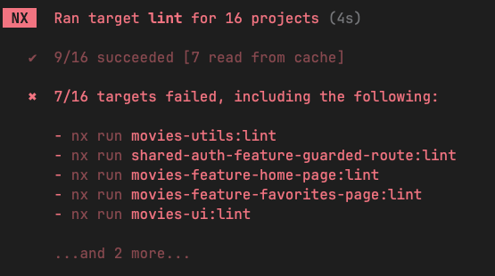

---

**[← Previous: Movies App Project Setup](./04-project-setup.md) | [Next: Custom Plugins →](./07-custom-plugin.md)**

---

# Nx Enforce Module Boundaries

In this exercise you'll learn how to enforce architecture constraints. We will use the built-in eslint rule `@nx/enforce-module-boundaries`
in order to configure how libraries are allowed to depend on each other.


## 1. Setup Scope Constraints

Let's setup constraints between different scopes.

Open the `.eslintrc.json` file in the root folder and locate the `@nx/enforce-module-boundaries` rule


```json
// eslintrc.json

"rules": {
  "@nx/enforce-module-boundaries": [
    "error",
    {
      "enforceBuildableLibDependency": true,
      "allow": [],
      "depConstraints": [
        {
          "sourceTag": "*",
          "onlyDependOnLibsWithTags": ["*"]
        }
      ]
    }
  ]
}
```

Change its configuration so that `scope:movie` can only depend on `scope:shared` & `scope:movie`.
Also `scope:shared` can only depend on `scope:shared`.

<details>
  <summary>Solution</summary>

```json
// eslintrc.json

[
  {
    "sourceTag": "scope:movies",
    "onlyDependOnLibsWithTags": ["scope:movies", "scope:shared"]
  },
  {
    "sourceTag": "scope:shared",
    "onlyDependOnLibsWithTags": ["scope:shared"]
  }
]
```

</details>


Run the lint command for affected projects to see if your changes break some rule or not.

First, reset nx in order make sure your changes are applied.

```bash
npx nx reset
```

Now run the lint

```bash
npx nx affected:lint
```

You should see something like this:



Looking closer at single target executions reveals the reason, some projects are missing tags.

```shell
> nx run movies-feature-detail-page:lint

> eslint .


/../ws-nx-summer2025/libs/movies/feature-movie-detail-page/src/movie-details.tsx
  10:1  error  A project without tags matching at least one constraint cannot depend on any libraries  @nx/enforce-module-boundaries
  11:1  error  A project without tags matching at least one constraint cannot depend on any libraries  @nx/enforce-module-boundaries
  12:1  error  A project without tags matching at least one constraint cannot depend on any libraries  @nx/enforce-module-boundaries
  13:1  error  A project without tags matching at least one constraint cannot depend on any libraries  @nx/enforce-module-boundaries

/../ws-nx-summer2025/libs/movies/feature-movie-detail-page/src/use-movie-details.ts
  3:1  error  A project without tags matching at least one constraint cannot depend on any libraries  @nx/enforce-module-boundaries
  4:1  error  A project without tags matching at least one constraint cannot depend on any libraries  @nx/enforce-module-boundaries

✖ 6 problems (6 errors, 0 warnings)
```

Let's fix this in the next step.

## 2. Configure tags

We need to tag our projects so that our eslint rule is able to treat them.

For each project, go ahead and assign the proper tag into the project.json file.

> [!NOTE]
> There are only a couple projects, that need to be adjusted:
> * movies-ui 
> * movies-feature-detail-page
> * movies-utils
> * shared-auth-ui-not-authenticated-page

Follow the pattern as described below.

**Libraries in libs/movies/**

* `"tags": ["scope:movies", "type:feature"]`
* `"tags": ["scope:movies", "type:data-access"]`
* `"tags": ["scope:movies", "type:ui"]`
* `"tags": ["scope:movies", "type:util"]`

**Libraries in libs/shared/**

* `"tags": ["scope:shared", "type:feature"]`
* `"tags": ["scope:shared", "type:data-access"]`
* `"tags": ["scope:shared", "type:ui"]`
* `"tags": ["scope:shared", "type:util"]`


<details>
  <summary>Solution</summary>

* movies-ui -> `["scope:movies", "type:ui"]`
* movies-feature-detail-page -> `["scope:movies", "type:feature"]`
* movies-util -> `["scope:movies", "type:util"]`
* shared-auth-ui-not-authenticated-page -> `["scope:shared", "type:ui"]`

</details>


Now run the linter again.

```bash
npx nx affected:lint
```

You should see that the configured rules are satisfied for now.


## 3. Setup Type Constraints

Now let's introduce another dimension to our architecture enforcement ruleset.
We are going to setup constraints within scopes & cross-scopes, **between types**.

Again open the `eslintrc.json` file and add the following rules:

* type feature can only depend on type feature, data-access, ui, util
* type data-access can only depend on type data-access, util
* type ui can only depend on type ui, util
* type util can only depend on type util

### feature

<details>
  <summary>Feature</summary>

```json
// eslintrc.json

[
  {
    "sourceTag": "type:feature",
    "onlyDependOnLibsWithTags": ["type:feature", "type:data-access", "type:ui", "type:util"]
  },
]
```

</details>

Great, go ahead and confirm that the rule you have applied is actually working.

Go to any library of type ui and try to import a file from a library of type feature.
If configured properly, your IDE should already warn you about something is wrong.

Run the lint command for affected projects to see if your changes break some rule or not.

```bash
nx affected:lint
```

### data-access

<details>
  <summary>data-access</summary>

```json
// eslintrc.json

[
  {
    "sourceTag": "type:data-access",
    "onlyDependOnLibsWithTags": ["type:data-access", "type:util"]
  },
]
```

</details>

Great, go ahead and confirm that the rule you have applied is actually working.

Go to any library of type data-access and try to import a file from a library of type ui.
If configured properly, your IDE should already warn you about something is wrong.

Run the lint command for affected projects to see if your changes break some rule or not.

```bash
nx affected:lint
```

### ui

<details>
  <summary>ui</summary>

```json
// eslintrc.json

[
  {
    "sourceTag": "type:ui",
    "onlyDependOnLibsWithTags": ["type:ui", "type:util"]
  },
]
```

</details>

Great, go ahead and confirm that the rule you have applied is actually working.

Go to any library of type ui and try to import a file from a library of type data-access.
If configured properly, your IDE should already warn you about something is wrong.

Run the lint command for affected projects to see if your changes break some rule or not.

```bash
nx affected:lint
```

### util

<details>
  <summary>util</summary>

```json
// eslintrc.json

[
  {
    "sourceTag": "type:util",
    "onlyDependOnLibsWithTags": ["type:util"]
  }
]
```

</details>

Congratulation, you have now enforced dependency constraints for your workspace architecture!

## 4. Test the setup

Great, go ahead and confirm that the rule you have applied is actually working.

E.g. go to any library of type ui and try to import a file from a library of type data-access. Or
try to break the scoping rule by importing something from the movies scope from within the shared scope.
If configured properly, your IDE should already warn you about something is wrong.

Run the lint command for affected projects to see if your changes break some rule or not.

```bash
nx affected:lint
```

---

**[← Previous: Scalable Architecture Design](./05-scalable-architecture-design.md) | [Next: Custom Plugins →](./07-custom-plugin.md)**

---
